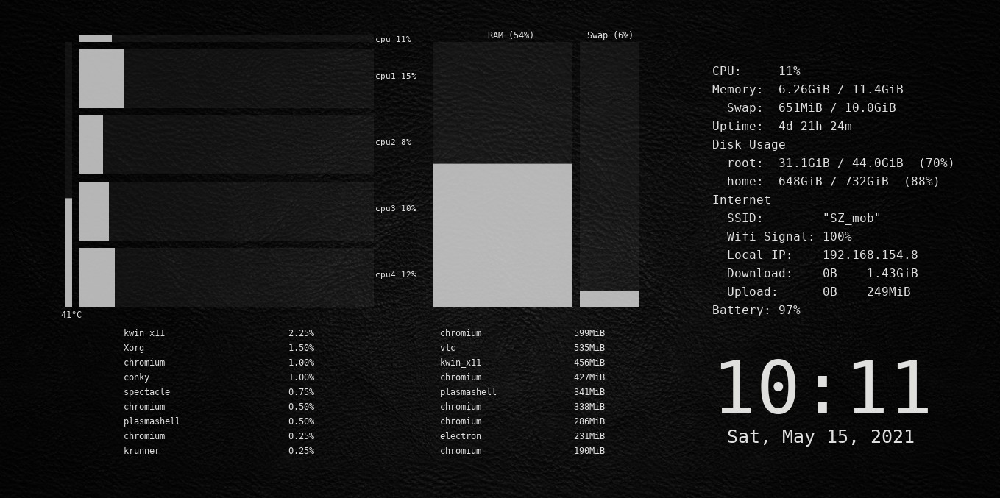
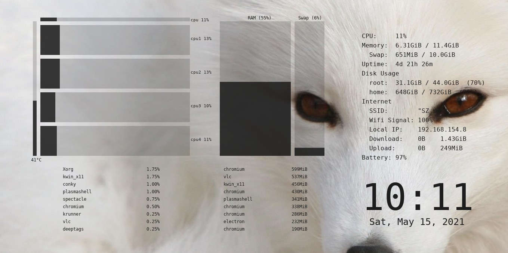

# Icosium Conky

Icosium Conky is a conky theme that comes with 4 different color schemes for dark and light themes

### monochrome dark

### monochrome light

### blue dark

### blue light

* * *

## Dependencies

- Conky v1.10+ with lua support

## How to change the theme

open the file `icosium.lua`, at the beginning of the script, change the string "monochrome dark" into one of the following:

- "monochrome light"
- "blue dark"
- "blue light"

## Wallpapers in the screenshots

- [black leather](https://wallpapercave.com/w/wp3657111)
- [white fox](https://wallpapercave.com/w/wp2342276)
